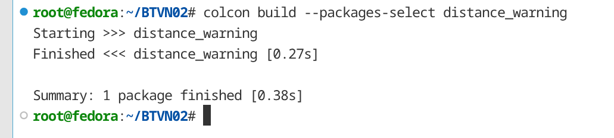
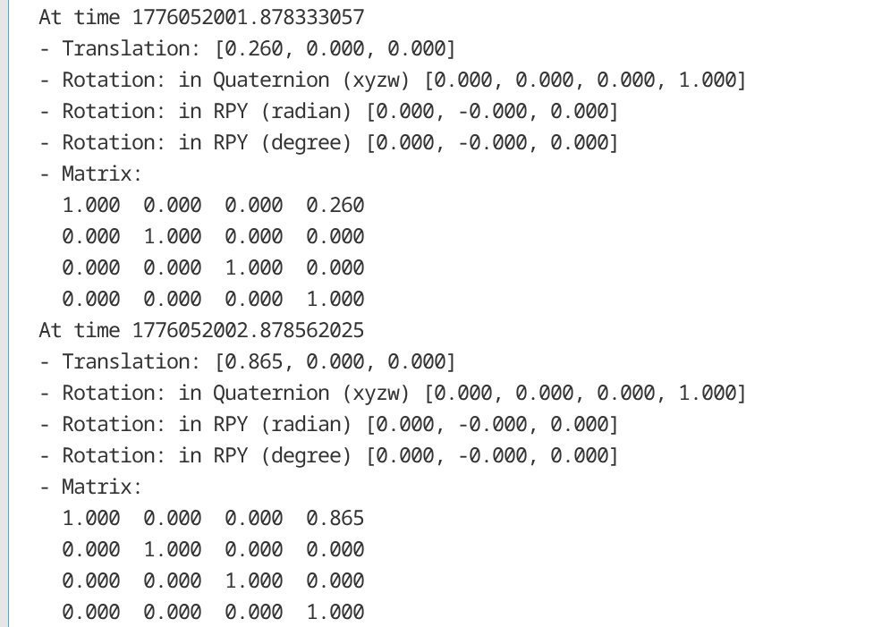

# Result

1. Package build không có warning sau khi thêm dependencies
   
   

2. distance_tf_broadcaster` broadcast đủ 2 frame lên `/tf`
   
   

3. `sensor_link` x thay đổi theo giá trị `/distance_topic`

4. `distance_tf_listener` tính đúng khoảng cách từ TF
   
   

5. Khi sensor > `tf_threshold`, tự động gọi `/set_threshold`

6. `/distance_reliable` publish đúng 1 Hz
   
   

7. `/distance_best_effort` publish đúng 10 Hz
   
   

8. Bảng stats in đúng số lượng sau 5 giây

9. QoS incompatible test → warning xuất hiện
   
   

10. Launch file full khởi động đủ 8 node
    
    
